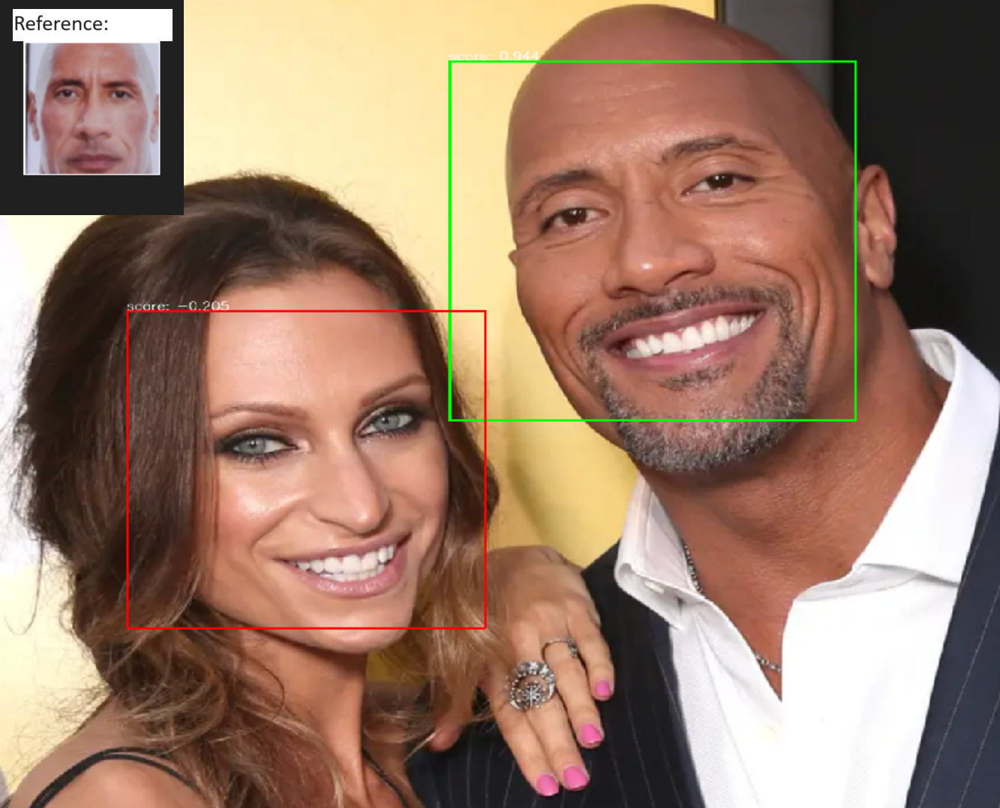

# Face recognition 

Train and run ResNet based siamese network for face recognition task using triplet loss

## Instructions

1. Install the required dependencies using pip:

```bash
  pip install -r requirements.txt
```
2. Make sure the data for the training and test is structured relative to the directory supplied as follows: 

```bash
data_dir:.
        ├───0
        ├───1
        ├───10
        .
        .
        .
        ├───1000
```
where each number corresponds to a folder containing different images of the same face

3. Train your model using the following command line input:
```bash
python  Train.py [-h] [-d DATA_DIR] [-m MODEL_PATH] [-f FEAT_EXTRACT] [-s SIM_METRIC] [-e EPOCHS] [-b BATCH] [-r LEARNING_RATE] [-t PLOT]
```
where the arguments are as follows:

```bash
Training Arguments

options:
  -h, --help            show this help message and exit
  -d DATA_DIR, --data_dir DATA_DIR
                        Path to extracted faces training data directory (default: ./Dataset/Extracted Faces/Extracted Faces)
  -m MODEL_PATH, --model_path MODEL_PATH
                        Path to model (save/load) (default: ./trained_model)
  -f FEAT_EXTRACT, --feat_extract FEAT_EXTRACT
                        Encoder feature extract, options: 'resnet18', 'resnet34', 'resnet50' (default: resnet50)
  -s SIM_METRIC, --sim_metric SIM_METRIC
                        Similarity metric, options: 'Euclidean', 'Cosine' (default: Euclidean)
  -e EPOCHS, --epochs EPOCHS
                        Number of epochs for training (default: 1)
  -b BATCH, --batch BATCH
                        Batch size (default: 5)
  -r LEARNING_RATE, --learning_rate LEARNING_RATE
                        Initial learning rate (default: 0.0001)
  -t PLOT, --plot PLOT  Plot learning trends (default: True)                       

```
4. Run inference where with respect to reference image of face using:
```bash
python  inference.py [-h] [-m MODEL_PATH] [-c CAM_PORT] [-s SIM_METRIC] [-r REF_PATH]
```
where the arguments are as follows:

```bash
Inference Arguments

options:
  -h, --help            show this help message and exit
  -m MODEL_PATH, --model_path MODEL_PATH
                        Path to model (save/load) (default: ./trained_model)
  -c CAM_PORT, --cam_port CAM_PORT
                        Camera port for acquisition (default: 0)
  -s SIM_METRIC, --sim_metric SIM_METRIC
                        Similarity metric, options: 'Euclidean', 'Cosine' (default: Euclidean)
  -r REF_PATH, --ref_path REF_PATH
                        Path to reference image (save/load) (default: ./reference.png)

```

## Project Structure

- Train.py: train and evaluate model
- Inference.py: Run inference using available camera with respect to reference image
- Encoder.py: Encoder model with resnet feature extractor
- requirements.txt: A list of python packages needed for the project.
- Dataset.py: data retrival class used for training.
- Losses.py: loss function available for training
- Utils.py: additional functions required for training
